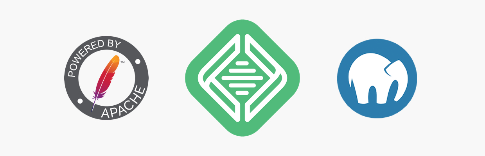

# Installation et prise en main de Wordpress

Dans ce cours, nous allons découvrir Wordpress et son interface d'administration et de gestion de contenu.
Avant cela, nous devrons cependant comprendre ce qu'est Wordpress et installer un environnement de développement local.

## Qu'est-ce que Wordpress ?

Wordpress est un [CMS](https://fr.wikipedia.org/wiki/Syst%C3%A8me_de_gestion_de_contenu) (en anglais, content management system) 
c'est-à-dire un système de gestion de contenu. Le CMS permet à son utilisateur de rédiger et publier son contenu, 
effectuer des choix visuels et de mise en page à partir d'une interface graphique facile à prendre en main. 
L'utilisateur n'a donc pas besoin d'avoir des notions de développement web pour gérer et administrer son site web.

Il existe de nombreux autre CMS sur le marché comme [Joomla](https://www.joomla.fr/) et [Drupal](https://www.drupal.org/).
Cependant, Wordpress demeure un leader incontesté. Environ 33% du web repose à l'heure actuelle sur un ecosystème Wordpress. 

## Création d'un serveur local

Un serveur local permet de faire tourner un site Internet sur son propre ordinateur et simule au mieux les conditions réelles 
d’un serveur d’hébergement web. En général un serveur local est composé d’Apache (ou Nginx) qui traite les requêtes (accès à une URL), 
de MySQL pour les bases de données et PHP pour interpréter le code et générer du HTML.

Une version locale de votre site Wordpress vous permet de tester de nouvelles fonctionnalités sans conséquences pour le site en ligne.
Vous pouvez ainsi tester de nouveaux plugins, ajouter du code ou enlever : le site en ligne n'est pas impacté.

> Attention à ne jamais faire de modification directement en production, il vaut mieux avoir une copie locale du site 
> ou un environnement dit de « staging » afin de tester en amont les modifications et bien veiller à ce qu’elles ne cassent pas le site !

Nous verrons par la suite la phase de mise en production, c'est-à-dire l'achat d'un hébergement en ligne, l'installation Wordpress sur
cet espace serveur et la duplication du site locale et de la base de données en vue de la mise en ligne. Pour l'instant, contentons-nous
de travailler sur un environnement de test en locale.

### Quel logiciel pour travailler en local ?

#### 1. Local by Flywheel

Rendez-vous sur le site de [Local by Flywheel](https://localbyflywheel.com/) pour télécharger l'installeur.
Le point fort de Local, c'est sa rapidité d'installation et de création d'un serveur de développement locale, mais il présente aussi
d'autres fonctionnalités avantageuses :

- Installation de Worpdress en un clic
- Gestion d'une multitude de serveurs locaux
- Url de démo pour présenter le site aux clients ou collaborateurs

[Vidéo utile concernant la prise en main de Local](https://www.youtube.com/watch?v=rm73DF3BH38)

#### 2. Mamp, Wamp etc.

Plus classiquement, il existe des logiciels permettant de créer sans trop d’efforts un serveur local sur votre machine. 
Parmi eux [MAMP](https://www.mamp.info/en/), [WAMP](http://www.wampserver.com/en/) et [Easy PHP](https://www.easyphp.org/). 
Ils ne sont pas dédiés qu’à WordPress et s’avéreront utiles si vous utilisez d’autres plateformes.

## Installation de Wordpress

### Sur Local

Sur Local, Wordpress est installé d'office lors de la création d'un nouveau site. Parfait !

### Sur Mamp, Wamp etc.

1. Rendez-vous sur le site de [Worpdress](https://wordpress.org/) puis sur la page de Téléchargement pour obtenir la dernière version de Wordpress.
2. Décompresser le fichier téléchargé et copiez-en le contenu.
3. Créér un dossier `Sites` dans votre dossier racine.
4. Dans ce dossier, créér un nouveau dossier au nom de votre site, par example `siteperso`.
5. Dans ce nouveau dossier, coller le contenu du dossier Worpdpress decompressé.
6. Dans le logiciel Mamp, accéder aux paramètres de serveur web `Preferences > Web server` et modifiez le document root
 pour qu'il pointe vers le dossier `Sites`

7. Créér la base de données en accédant à l'url `http://localhost/phpMyAdmin` (pour Windows et Wamp) ou `http://localhost:8888/phpMyAdmin` 
(pour Mac et Wamp)

7. Accéder à l'url du site local `http://localhost/test` (pour Windows et Mamp) ou `http://localhost:8888/text` 
pour lancer à l'installation Wordpress
8. L'installeur Wordpress va vous demander vos identifiants et mots de passe de base de données. Vous pouvez les retrouver sur la page 
de démarrage MAMP

9. Il ne vous reste plus qu'à suivre les étapes d'installation !

## Prise en main de Wordpress

L'interface d'administration est divisée en trois panneaux principaux : la barre d'outils, la barre de navigation latérale et l'espace d'édition.

### La barre d'outils

La barre d'outils est affichée en haut de chaque page d'administration et regroupe différentes fonctionnalités ou outils :

- Un accès rapide à la documentation et au forums de support Wordpress
- Un menu d'accès rapide au site/sites 
- Un accès rapide au tableau de bord avec aperçu du nombre de mises à jours disponibles
- Un outil de création rapide permettant d'ajouter au choix : une page, un article, un utilisateur ou un média
- Un accès rapide à la gestion du profil d'utilisateur

### La barre de navigation latérale

La barre de navigation latérale donne accès à chaque page d'administration disponible sur le site. Après avoir installé un plugin, 
on constate souvent l'apparition d'un nouveau pictogramme dans la barre de navigation latérale donnant accès aux fonctionnalités proposées par
le plugin en question. Un bouton en bas de la barre latérale permet d'en réduire la largeur et de la transformer en liste d'icônes, laissant ainsi
davantage de place pour l'espace d'édition.

### L'espace d'édition

L'espace d'édition regroupe l'ensemble des fonctionnalités et informations relatives à la page d'administration sur laquelle on se trouve.
C'est là que peut éditer, modifier ou parmètrer le site Wordpress.

1. **Tableau de bord**

Le tableau de bord est la page d'administration qui s'affiche par défaut lorsqu'on accède à l'interface d'administration Wordpress.
Elle liste les activités récentes sur le site, fournit un récapitulatif du site, un outil d'édition d'article rapide ainsi que
certaines actualités liées à l'écosystème et à la communauté Wordpress.

2. **Articles**

Cette page présente une liste de l'ensemble des articles publiés sur le site. Sur la première page, on peut ajouter/supprimer un article ou
effectuer des modifications rapides sur un ou plusieurs articles. Depuis cette liste, on peut bien évidemment accéder à l'outil d'édition 
Wordpress sur lequel nous reviendrons plus tard.

C'est aussi là que l'on créée/supprime les catégories ou mots-clés qui permettent de trier les articles du site.

3. **Médias** 

Cette page est l'outil de  gestion des médias, c'est-à-dire l'ensemble d'images, de vidéos ou tout autre type de fichiers utilisées sur le site
Wordpress. Elle propose un outil de visualisation, de gestion et d'édition de l'ensemble de la bibliothèque, ainsi qu'un outil pour ajouter 
des médias.

4. **Pages**

Cette page présente une liste de l'ensemble des pages publiées sur le site. Sur la première page, on peut ajouter/supprimer une page ou
effectuer des modifications rapides sur une ou plusieurs pages. Depuis cette liste, on peut bien évidemment accéder à l'outil d'édition 
Wordpress sur lequel nous reviendrons plus tard.

5. **Commentaires**

Cette page présente une liste des commentaires déposés par les lecteurs sur les articles du site. Comme sur les pages Articles et Pages, 
cet outil permet la suppression ou modification sur un ou plusieurs commentaires.

6. **Apparence**

Depuis cette page, on peut contrôler comment se présente le contenu du site grâce aux thèmes, widgets et autres options de personnalisation.
  - Thème — installer et activer un thème qui definira l'apparence du site web dans son integralité. 
  - Personnaliser — personnaliser le thème, en fonction bien sûr, de ce que le thème fournit comme option. 
  - Widgets — ajouter des modules que l'on place dans des zones prévues à cet effet par le thème (Calendrier, Archives, Catégories etc.).
  - Menus — ajouter des menus personnalisés.

7. **Extensions**

Depuis cette page, on peut installer, activer et mettre à jour des extensions (ou plugins) qui apportent des fonctionnalités supplémentaires 
au site Wordpress.

8. **Utilisateurs** 

Cette page présente tout d'abord une liste des utilisateurs du site avec possibilité d'ajouter/supprimer un utilisateur
ou d'effectuer des actions rapides sur l'ensemble ou une portion des utilisateurs enregistrés. On retrouve également ici la possibilité 
d'éditer son profil utilisateur.

9. **Outils** 

Cette page propose un ensemble d'outils facilitant la gestion de certains aspects du site.
On y retrouve notemment un outil d'importation et d'exportation du site, utile en cas de migration.
Un autre outil permet d'obtenir un bilan sur les améliorations possibles à apporter au site.

10. **Réglages**

Cette page regroupe de nombreux paramètres généraux du site :
- Général — réglages relatifs au site, son titre, son slogan, l'administration et le langage
- Écriture — réglages relatifs à la publication d'article
- Lecture — réglages relatifs à la lecture d'article, la page d'accueil etc.
- Discussion - réglages relatifs aux commentaires
- Médias - réglages relatifs aux médias, taille d'image etc.
- Permaliens - réglages relatifs aux liens urls des articles, pages etc.
- Confidentialité - réglages relatifs à a page Politique de confidentialité

### Les Contenus

C'est le cœur du site web, c'est-à-dire ce qu'il propose comme contenus et la manière dont il organise et trie ces contenus.

#### Types de Publication

Par défaut, dans Wordpress, il existe deux types de publication : les **Articles** et les **Pages**. Il s'agit des grandes familles de publication.
Les premiers sont au cœur du Blog, affichés en liste et catégorisables. Les deuxièmes sont tout à fait semblables à des pages sur un site web
classique (About, Contact, etc.).

Imaginons la création d'un site de présentation professionnelle contenant un **Portfolio** et un **Blog**. Il conviendrait de faire la différence
entre les publications du Blog (posts) et les publications du Portfolio (projets). Nous reviendrons plus tard sur la création de types de publication.

#### Taxonomies

Par définition une taxonomie est l’action d’idientifier et  classer des être vivants. Dans WordPress c’est la manière dont on va classer nos articles. 
Par défauts il existe 2 méthodes de rangement : les **catégories** et les **mots-clés**.

Les catégories sont plutôt prédéfinies et fixes, alors que les mots-clés sont en saisie libre. Les mots-clés sont complémentaires aux catégories 
et permettent par exemple de lister tous les articles parlant d’un thème commun mais qui ne sont pas forcément dans la même catégorie 
Prenons un blog geek par exemple dontl es catégories sont : films, comics, jeux vidéo, livres. Si un article parle de Marvel, en cliquant sur ce 
mot clés on obtiendra la liste de tous les articles qui parlent de Marvel, qu’ils soient indépendamment dans films, dans comics ou dans jeux vidéo.

#### Termes

Les termes d'une taxonomie sont les termes qui la compose. Pour reprendre l’exemple précédent, dans catégories, les termes sont Jeux vidéo, films, 
comics … ou alors entrées, plat principal, desserts dans un custom types « nos recettes » par exemple.

## Liste de liens utiles sur Wordpress

- [Codex Wordpress](https://codex.wordpress.org/fr:Accueil) — documentation officielle de Wordpress
- [WP Marmite](https://wpmarmite.com/) — tutos pour créer et personnaliser des sites WordPress pas à pas.
- [GeekPress](http://www.geekpress.fr/) — Actualités et tutoriels Wordpress
- [WP pour les nuls](https://www.wppourlesnuls.com/) — Actualités et tutoriels Wordpress
- [WP Formation](https://wpformation.com/) - Formations, actualités et tutoriels Wordpress
- [Kinsta](https://kinsta.com/resources/) - Hébergeur Wordpress, sections ressources et blog bien alimentés

## Exercices et mise en application

1. Choisir un thème pour le blog
2. Changer le titre du site, son slogan et le logo
3. Création d'un article
4. Création d'une page
5. Création de catégories et sous-catégories
