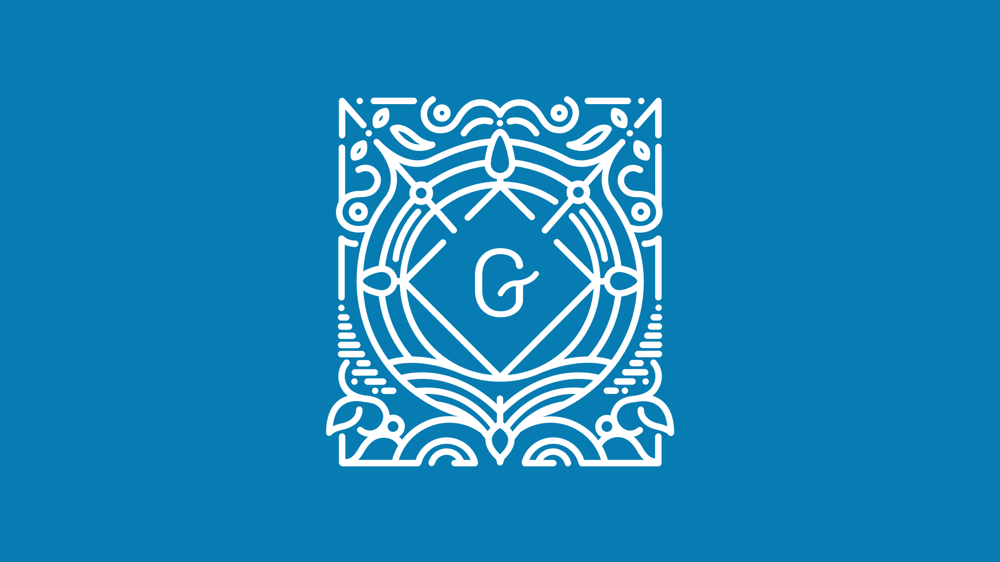
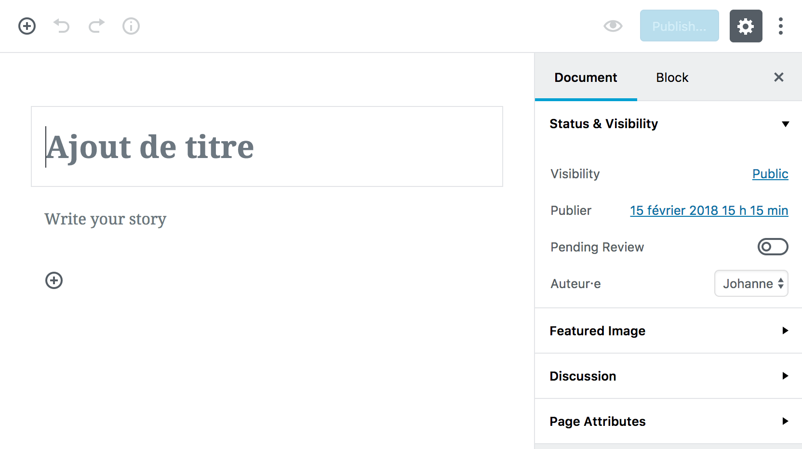
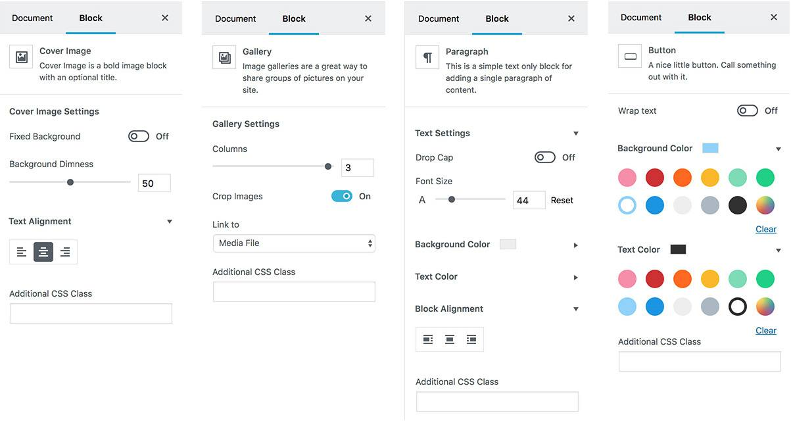
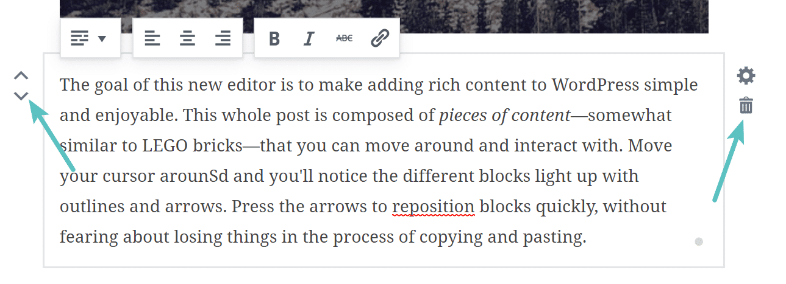
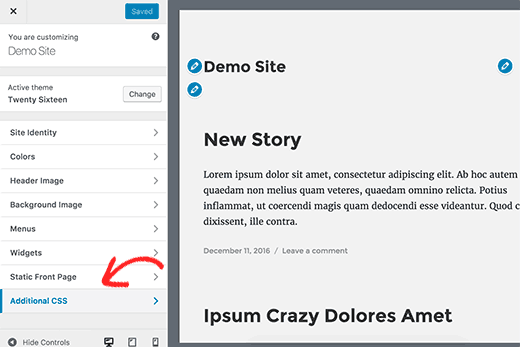
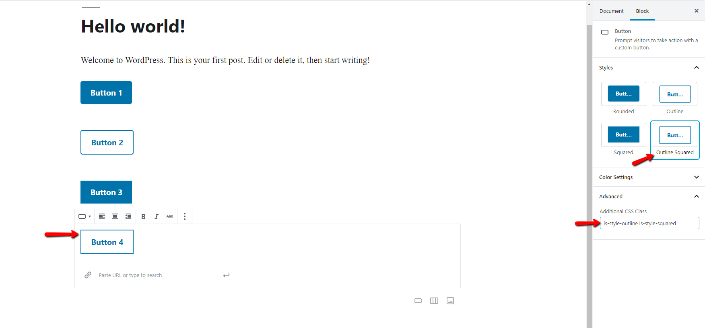
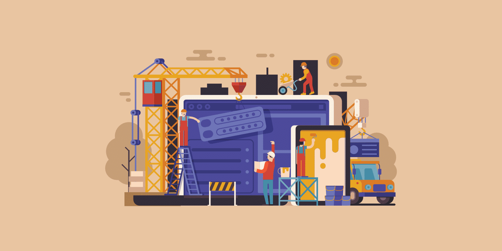

# Aller plus loin avec Wordpress :mag:

Dans ce cours, nous explorons l'éditeur de contenu de Wordpress, Gutenberg. Nous allons commencer à personnaliser le thème et ajouter des plugins
pour aller plus loin dans la composition des pages et articles. Nous allons également nous plonger dans la grande question des thèmes :
Comment les choisir ? Comment les prendre en main ? Comment les personnaliser ?

## Gutenberg : l'éditeur de contenu Wordpress

Depuis Wordpress 5.0, Gutenberg est l'éditeur par défaut sur l'interface d'administration. Il porte le nom de Johannes Gutenberg, qui a inventé 
une presse à caractères mobiles il y a plus de 500 ans. À la difference de son prédecesseur (WYSIWYG), il fonctionne sur une logique de blocs
de contenu enrichi (images, texte, texte en exergue, vidéo etc.) que l'on agence dans la page ou l'article.

### L'interface 

*l'interface d'édition Gutenberg*

En haut à gauche de la fenêtre d'édition se présentent 4 boutons permettant :
- **d'ajouter un bloc** 
- **d'annuler** ou de **rétablir** une action 
- **d'obtenir des informations** sur la publication en cours d'édition
- de visualiser et de **naviguer dans la structure de blocs**

En haut à droite nous retrouvons les boutons d'édition principaux : **Enregister en brouillon**, **Prévisualiser** et **Publier**.
Le bouton engrenage permet d'afficher ou cacher le panneau latéral (à droite) de réglages. Dans ce panneau, nous retrouvons 2 onglets :
- l'onglet **Document** (la publication en cours d'édition) qui donne accès aux paramètres de visibilité, de permaliens, de catégories,
d'étiquettes et d'image mise en avant.
- l'onglet **Bloc** qui donne accès aux paramètres relatifs au bloc selectionné. Bien évidemment, les paramètres visibles dans cet onglet varie en 
fonction du bloc selectionné (texte ou image par exemple) et du thème et des paramètres qu'il propose.

### Les blocs de contenu

Les blocs Gutenberg sont comme des briques de contenu que l'on empile pour composer une page ou un article. Pour ajouter un bloc on clique sur le
petit + visible en haut à gauche. Par défaut le bloc va s'ajouter en dessous du dernier bloc du document. Si un bloc est déjà selectionné, le bloc
créé va s'ajouter en dessous de ce dernier.

On distingue 5 groupes de blocs de contenus :

- **Communs** : ce sont les blocs basiques – les titres, les paragraphes, les listes à puce, les citations, les images, les galeries d’images, etc.
- **Formattage** : ce sont les différents formats dans lesquels vous pourrez rédiger vos contenus – classique, HTML, code source, texte préformatté, etc.
- **Mise en page** : il s’agit des blocs qui vous permettront de soigner votre mise en page. C’est à mon sens le groupe le plus important, mais il est encore très pauvre pour le moment – séparateur, colonnes, boutons, etc.
- **Widget** : vous pourrez, dans ce groupe, retrouver vos widgets WordPress et les intégrer directement dans vos pages / articles.
- **Embed** : ce sont des contenus embarqués depuis d’autres plateformes (YouTube, Flickr, Twitter, Tumblr, etc.).

Lorsque l'on survole un bloc, les options de déplacement s'affichent, nous permettant de le faire monter/descendre d'un étage ou de le replacer
avec un sytème de drag and drop.
Lorsque l'on selectionne un bloc, des paramètres supplémentaires s'ajoutent à ceux de déplacement. Par exemple, il est possible de changer le style
ou le type du bloc que nous sommes en train d'éditer ou son style d'affichage. D'autres options sont généralement disponibles via un menu additionnel
(Dupliquer, éditer en HTML, supprimer, déplacer…) 

## Personnalisation : les premiers pas

### La Typographie

La plupart des thèmes Wordpress (surtout les plus basiques) ne permettent pas une grande personnalisation de la typographie. Pour pallier à ce
manque, il existe de nombreux plugins qui donne accès à des catalogues en ligne de webfonts, comme Google Fonts par exemple. Nous allons installer
un plugin qui donne accès au catalogue Google Fonts : [Google Fonts Typography](https://wordpress.org/plugins/olympus-google-fonts/).

Grâce à ce plugin, nous pouvons assigner une police à certains niveaux de texte (Titres, éléments de navigation, texte courant etc.) ou simplement
importer les polices pour les utiliser dans notre fiche de style CSS. 

À savoir : il existe d'autres manières d'ajouter des polices à un thème Wordpress :
- Avec une règle `@import` que l'on insère dans le fichier styles.css du thème ou comme style CSS additionnel (plus simple, moins performant)
- Avec une fonction `wp_enqueue_style` à ajouter dans le fichier functions.php du thème (resevé aux utilisateurs plus experimentés mais plus performant)

### Encore plus de blocs !

Les blocs de contenu mis à notre disposition par l'éditeur Gutenberg sont un grand progrès mais ils sont parfois un peu limités dans la personnalisation qu'ils offrent.
Ils existent des plugins qui nous permettent d'obtenir plus de blocs et plus de personnalisation sur ces derniers. Le plus connu est sans doutes
[Ultimate Addons for Gutenberg](https://www.ultimategutenberg.com/) développé par Brainstorm Force, une entreprise indienne spécialisée WordPress.

### Et le CSS ?

Si l'on souhaite aller plus loin dans la personnalisation de certains éléments, il est possible d'ajouter ou modifier des propriétés CSS. 
Pour ce faire, rendons nous
dans l'onglet Personnaliser du panneau 'Apparence'. Pour la grande majorité des thèmes disponibles sur Wordpress, on trouvera dans le menu de 
personnalisation un onglet 'CSS additionnel' dans lequel on peut ajouter des propriétés CSS à notre certains éléments du thème.

Avec Gutenberg, nous pouvons également ajouter des classes CSS additionels à des blocs. Nous pouvons ensuite les retrouver dans notre éditeur de
style CSS additionnel et ajouter les propriétés CSS pour obtenir le résultat visuel attendu

## Les Thèmes Wordpress

Dans WordPress, un thème est un ensemble de fichiers modèles (templates) et de feuilles de style utilisés pour définir l’apparence et la présentation du contenu d’un site. On pourrait vulgairement appeler cela un design de site.

Ils peuvent être ajoutés, modifiés, et gérés dans le menu Apparence > Thèmes. Un très grand nombre de thèmes gratuits ou payants sont disponibles sur internet. Le répertoire Thèmes de WordPress.org en contient de nombreux, mais si vous n’y trouvez pas votre bonheur, vous en trouverez davantage sur des boutiques de thèmes WordPress.

Chaque thème dispose de son propre design, sa mise en page et ses fonctionnalités. Certains sont conçus pour servir un type spécifique de sites, comme les thèmes pour photographes par exemple.

Un utilisateur doit choisir celui qui lui convient en fonction de ses goûts et de ses besoins pour son site.

Les thèmes peuvent être modifiés en ajoutant des extensions (plugins) ou en ajoutant du code au fichier functions.php. Il est également possible de personnaliser un thème en créant un thème enfant.

### Les notions à garder en tête lors du choix d'un thème

- **Simplicité** — Éviter les thèmes complexes et trop chargés en fonctionnalités, animations. Le thème se doit d'être fonctionnel mais simple
dans sa prise en main. 
- **Légèreté** — Préférer des thèmes légers, qui ne ralentiront pas votre site.
- **Fonctionnalités** — Quelles fonctionnalités sont nécessaires à votre site ? Dans la recherche de thèmes, de nombreux filtres permettent de 
préciser votre recherche
- **Compatibilité** — S'assurer que le thème est bien compatible avec les plugins que je souhaite utiliser
- **Popularité** — Les thèmes les mieux notés le sont en général pour de bonnes raisons
- **Documentation** — S'assurer de la présence d'une documentation fournie et détaillée
- **Tester** — Pour savoir si un thème est le bon, il faut surtout tester.

### Thèmes à suivre et à essayer !

- [OceanWP](https://oceanwp.org/)
- [Hestia](https://themeisle.com/themes/hestia/)
- [Astra](https://wpastra.com/)
- [Make](https://thethemefoundry.com/wordpress-themes/make/)
- [Neve](https://themeisle.com/themes/neve/)
- [GeneratePress](https://generatepress.com/)

### Autres liens utiles concernant le choix d'un thème

- [WP Marmite - Thèmes WordPress](https://wpmarmite.com/themes-wordpress/) - Actualités et articles détaillés sur les thèmes WP.
- [WP Formation — Thèmes Wordpress](https://wpformation.com/wordpress/themes-wordpress/) - Actualités et articles détaillés sur les derniers sthèmes WP.
- [Graph Paper Press](https://graphpaperpress.com/) - Boutique de thèmes
- [CSS Igniter](https://www.cssigniter.com/themes/) - Boutique de thèmes

## Les constructeurs de page : aller plus loin sans (trop) coder

Les constructeurs de page sont des extensions Wordpress qui permettent de composer des pages du site en y ajoutant toutes sortes de modules comme
des carousels, des images, des vidéos, des colonnes, des galeries de produits ou de portfolio etc. 

Comme Gutenberg ? Pas tout à fait… En effet les constructeurs de pages sont bien plus complets et capables que le simple éditeur Gutenberg.
Grâce aux constructeurs de page, il est maintenant possible d'aller beaucoup plus loin avec Wordpress sans coder.

Même si une page Contactez-nous est l’une des pages les plus rudimentaires à construire, il faut une quantité décente de formatage, de codage 
et de maux de tête pour compléter le processus sans un constructeur visuel. Pourtant, quand vous installez un constructeur de page WordPress, 
tout cela change. Non seulement les développeurs expérimentés peuvent accélérer le processus de développement, mais les débutants n’ont plus 
à se soucier de ce code compliqué.

### Constructeurs les plus populaires en 2019

- [Elementor](https://wordpress.org/plugins/elementor/)
- [GeneratePress et Sections](https://generatepress.com/downloads/generate-sections/)
- [Beaver Builder](https://wordpress.org/plugins/beaver-builder-lite-version/)
- [Divi](https://www.elegantthemes.com/plugins/divi-builder/)
- [WP Page Builder](https://wordpress.org/plugins/wp-pagebuilder/)
- [Page Builder par Site Origin](https://siteorigin.com/page-builder/)
- [Page Composer](https://visualcomposer.io/)

### Elementor

Le téléchargement gratuit d’Elementor offre un générateur de page WordPress simple mais puissant, avec l’une des interfaces les plus rapides 
que vous puissiez trouver. Tout est instantané, du montage en direct au chargement instantané de la page. Le générateur de pages standard 
comprend des animations, des diviseurs, des fonds en dégradé et des effets de titre. 

Il y a même une bibliothèque de modèles avec des modèles 
WordPress époustouflants, que vous pouvez tous choisi. La version gratuite d’Elementor est également conviviale pour les utilisateurs mobiles, 
avec des outils pratiques pour le mode maintenance, les pages en construction, les pages de renvoi, etc.

## Exercices et mises en application

Pour laprochaine séance :

- **Choisir un thème**
- **Styliser la home page** pour la rendre attrayante et harmonieuse. Elle doit présenter de manière simple et concise votre blog et son contenu.
  On y retrouvera les derniers articles des grandes catégories du site. Ces différentes sections ne sont pas forcément stylisées de la même façon.
- **Styliser les pages Articles**. La priorité sera donnée au confort de lecture, aux interactions texte/image, à la mise en avant du titre et de
  l'image mise en avant.

Pour la suite :
- **Entamer une réflexion sur le portfolio**. Quel hièrarchie des contenus ? Quel thème ? Quels plugins ?

  

