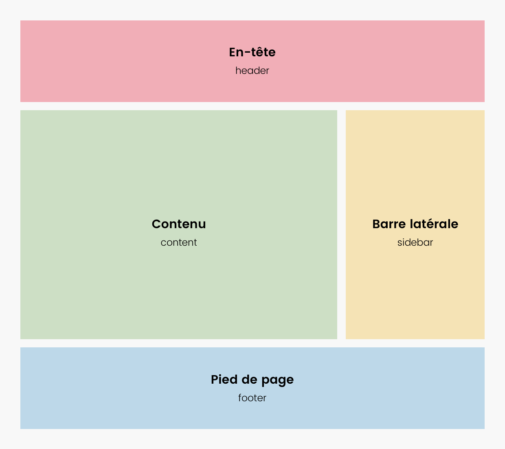
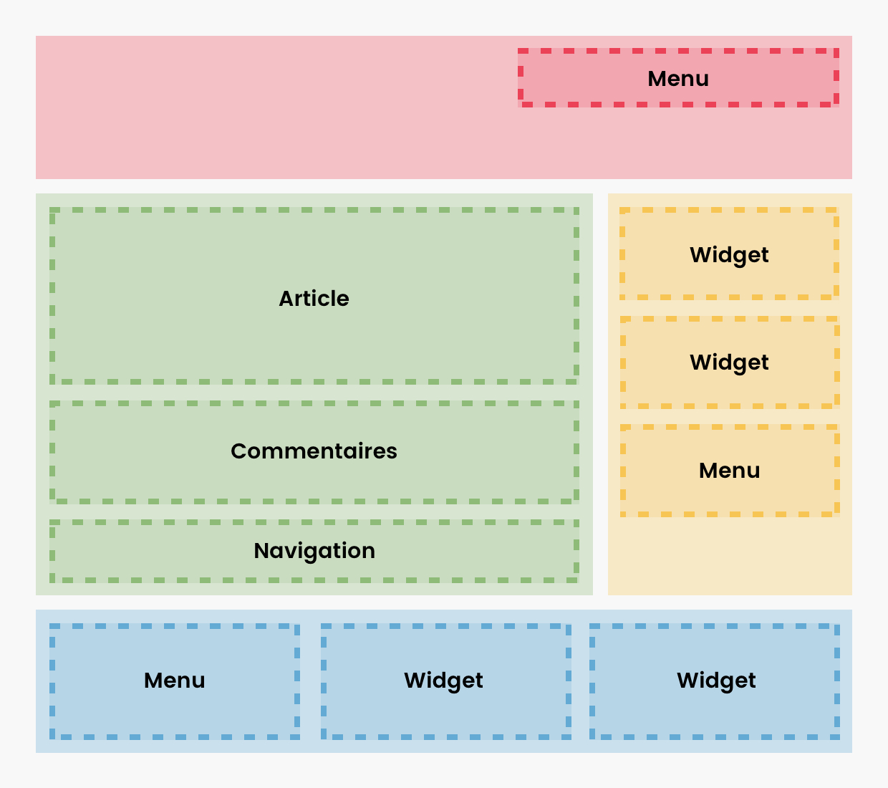
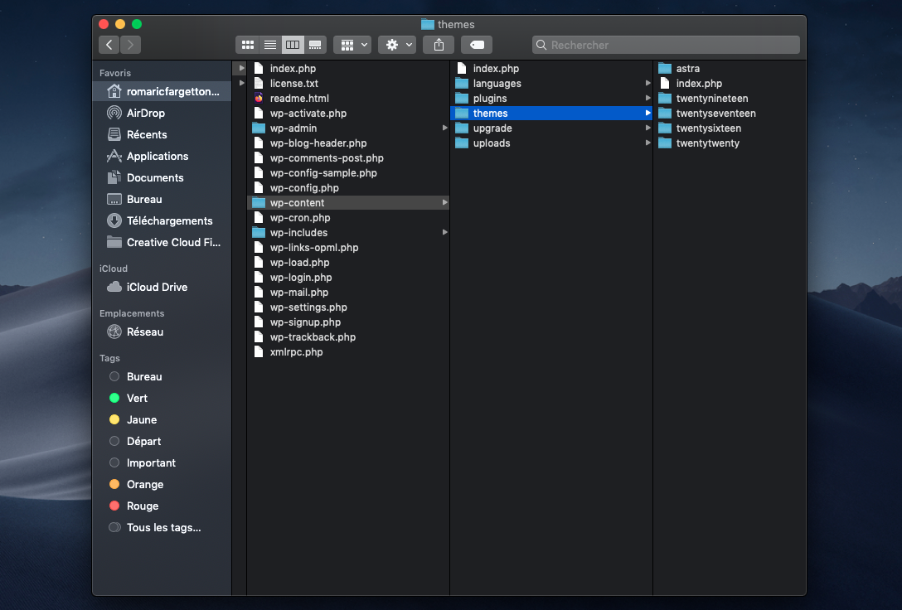
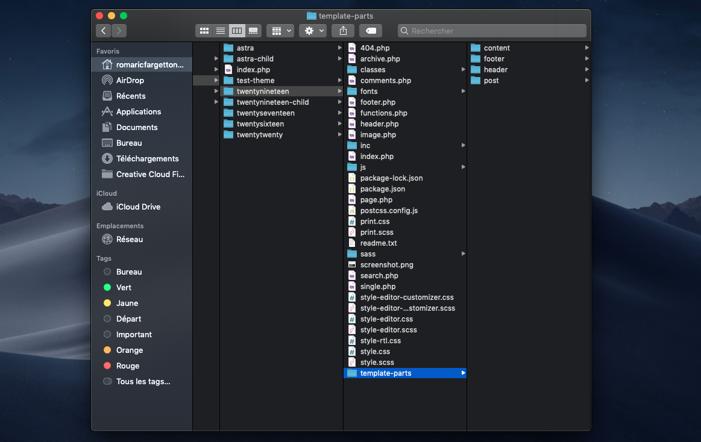
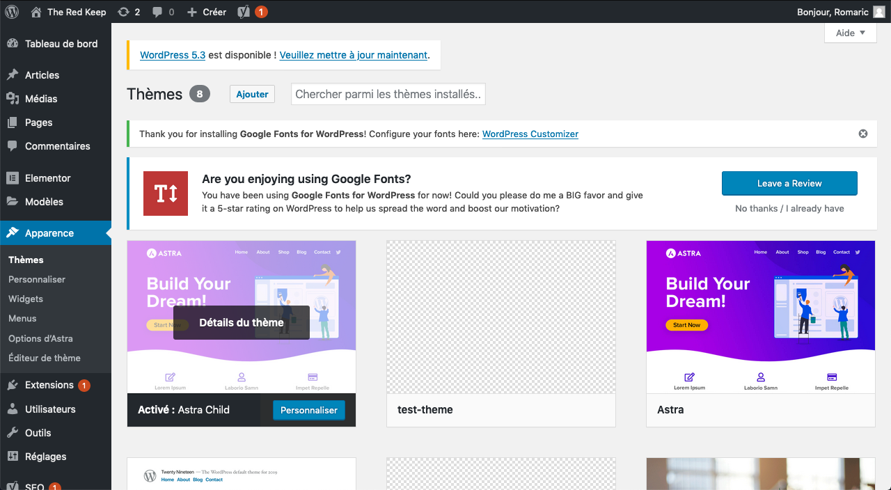
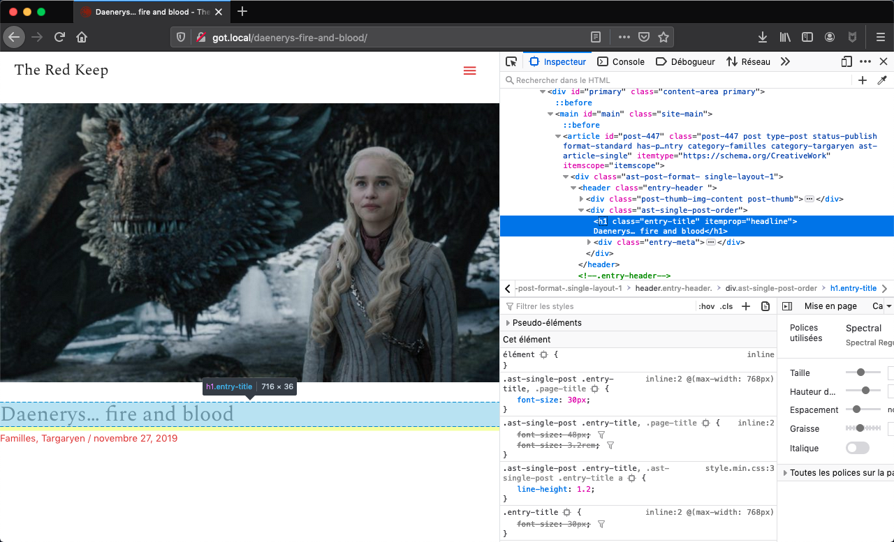
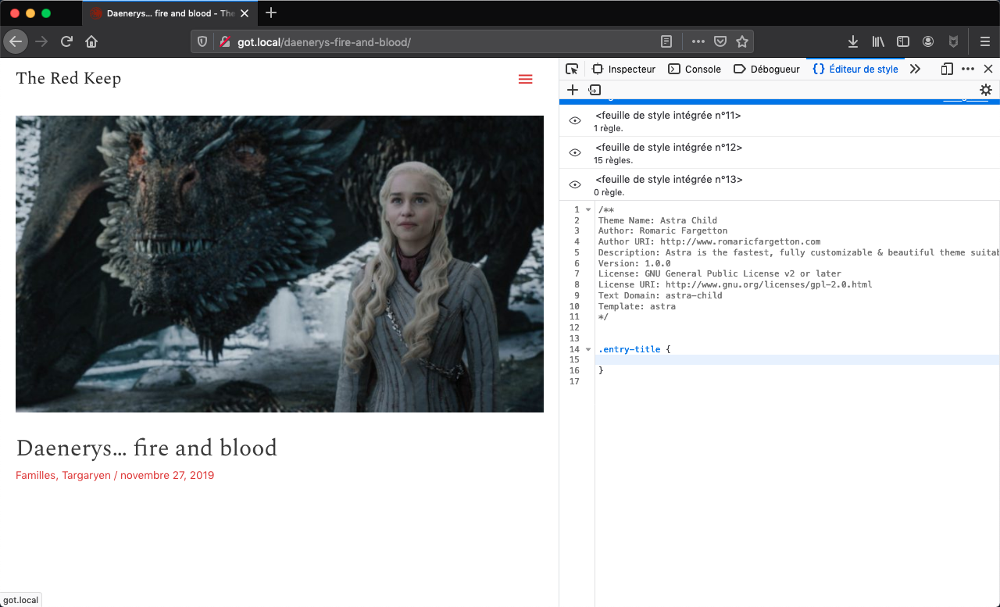
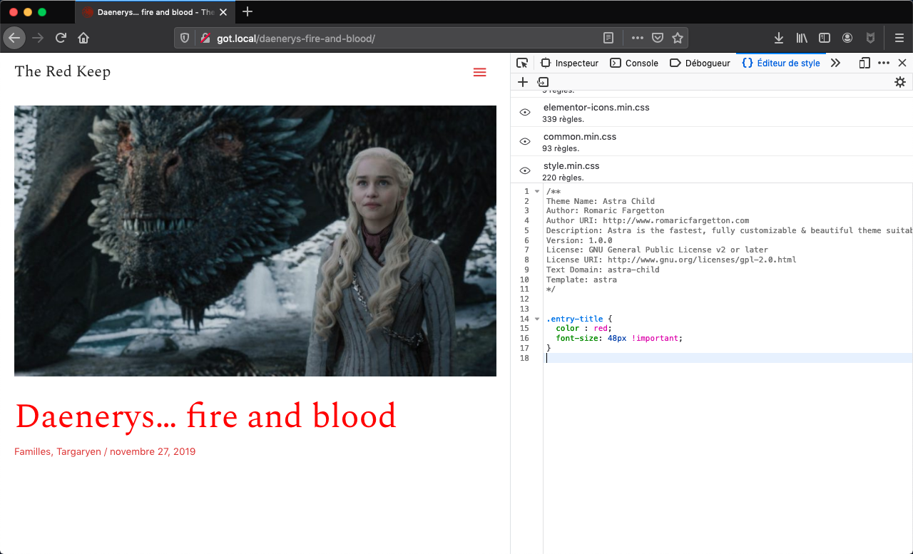

# Comprendre les thèmes Wordpress et les modifier

Après avoir decouvert l'éditeur Gutenberg, les plugins qui peuvent l'accompagner, ainsi que les page builders tels que Elementor, nous allons ajourd'hui 
étudier comment aller plus loin dans la personnalisation de notre thème Wordpress.

## L'anatomie d'un thème Wordpress

### Les zones typiques d'un site/blog



Dans un site ou blog Wordpress, on retrouve toujours 4 grandes zones :

- le Header : l'en-tête de site, présente sur toutes les pages --> `header.php`
- le Footer : le pied de page, présent sur tourtes les pages --> `footer.php`
- le Content : le contenu principal, différent sur chaque page --> `content.php`
- la Sidebar : une éventuelle barre latérale contenant des informations diverses --> `sidebar.php`

Dans un thème Wordpress, on retrouve généralement un fichier pour chacune de ces zones.

### Les composants typiques d'un site/blog



Chaque zone est elle-même divisée en composants typiques :

- Les menus : un dans le header en général, et certains dans la sidebar ou le footer
- Les commentaires : à la suite d’un article (dans les pages articles seulement)
- Les widgets : dans les sidebars ou le footer pouvant afficher les derniers articles, les catégories, un contenu statique…
- La navigation : pour aller à l’article suivant ou précédent.

### Les pages typiques d'un site Wordpress

- Home : la page d'accueil du site --> `index.php`
- Article : une page d'article -->  `single.php`
- Categorie : une page présentant les articles appartenant à une certaine catégorie --> `archive.php`

## Localiser les fichiers du thème

Pour trouver les fichiers qui composent un thème, on se rend dans tout d'abord dans le dossier racine de notre site.
Ensuite, il faut chercher le dossier `wp-content`, dans lequel réside un sous-dossier `themes`.
Pour les utilisateurs de Local, une fois dans le dossier racine du site, ces dossiers sont visible dans `app/public`.
On retrouve en effet tous les thèmes installés dans des dossiers du même nom.



On retrouve dans le dossier d'un thème un grand nombre des composants de thème que nous avons mentionnés.



## Le stricte minimum pour déclarer un thème Wordpress


Pour exister et être activé dans l'interface d'administration, un thème Worpdress a besoin de 2 fichiers au minimum :
- index.php
- style.css

1. Dans le fichier `style.css`, on déclare les informations relatives au thème de la façon suivante :

```css
/*
  Theme Name : The Red Keep
  Author : Romaric Fargetton
  Author URI : www.romaricfargetton.com
  Description : A simple Wordpress starter theme
  Version : 1.0
*/
```
2. Dans le fichier `index.php`, on pose la structure basique d'une page d'accueil en HTML :

```html
<!doctype html>
<html>
  <head>
  </head>
  <body>
    <h1>Hello World !</h1>
  </body>
</html> 
```

Vous avez maintenant la base fonctionnelle d'un thème Wordpress ! En vous rendant dans l'onglet 'Thèmes' du panneau 'Apparence' de l'interface Wordpress, vous
retrouverez le thème que vous venez juste de créer.



## Modifier l'apparence d'un thème Wordpress

Maintenant que nous savons ou se trouve les "boyaux" d'un thème Wordpress et de quoi ils sont composés, nous voyons mieux, donc, comment modifier un thème
existant. On pourrait être tenté d'intervenir directement sur les fichiers d'un thème mais c'est à proscrire. Il est préférable de créér un thème "enfant".

### Créer un thème enfant

Un thème enfant est un thème basé sur votre thème parent. Il en reprend toutes les fonctionnalités sans jamais le modifier. Ainsi vous pouvez apporter des modifications à votre enfant et en cas de mise à jour du parent, vous ne les perdez pas!

Tout fichier placé dans le thème enfant et portant le même nom que dans le thème parent, prendra le dessus et écrasera le fichier d’origine (sauf le functions.php).

A noter : de nombreux thèmes premium de nouvelle génération, embarquent dans leur zip un thème enfant prêt à l’emploi ou propsent un outil de création automatisé en ligne. 
Dans ce cas, il vous suffit juste de mettre en place ce dernier. **Attention, il faut bien évidemment installer le thème parent (sans l’activer), puis installer le thème enfant et enfin activer ce dernier.**

La première chose à faire est donc de créer un dossier au nom du thème, comme dans la section précédente, dans `wp-content/themes`.

Nous allons maintenant créer 2 fichiers essentiels pour l'existence de notre thème enfant :
- style.css
- functions.php

1. Dans le fichier functions.php, nous allons intégrer le code qui va permettre de combiner ou d’écraser le fichier style.css du parent autrement qu’avec le fameux @import css :
```php
<?php
function theme_enqueue_styles() {
    wp_enqueue_style( 'child-style', get_template_directory_uri() . '/style.css' );
}

add_action( 'wp_enqueue_scripts', 'theme_enqueue_styles' );
```
2. Dans le fichier style.css, nous déclarons les informations relatives au thème enfant :
```css
/*
Theme Name: Test Child Theme
Description: A test child theme
Author: Romaric Fargetton
Author URI: www.romaricfargetton.com
Template: astra
Version: 1.0
*/
```
En vous rendant dans l'onglet 'Thèmes' du panneau 'Apparence' de l'interface Wordpress, vous
retrouverez le thème enfant que vous venez juste de créer.

### Modifier l'apparence du thème enfant

Vous allez maintenant pouvoir modifier la mise en forme de l’ensemble des éléments graphiques du site.
Que ce soit les couleurs, les positionnements, les tailles des textes, les polices… bref, vous avez la main.

Vous pouvez commencer à ajouter des règles CSS dans le fichier `style.css` que vous avez créé et elles seront prises en compte à chaque raffraichissement de la page.
Pour que la nouvelle règle CSS soit prise en compte, il est parfois nécessaire d'ajouter l'exception `!important` après la règle CSS :

```css
.site-header a {
  color : red !important;
}
```

Pour fluidifier le processus de développement, il est recommandé de tester l'ajout de nouvelles règles CSS dans l'environnement de développement integré
à votre navigateur internet. L'idée est d'identifier l'élément que vous souhaitez modifier (un titre, un lien etc.) en inspectant le code de la page.



Une fois l'élément identifié, vous pouvez noter la classe qui y est associée et la reporter dans votre fenêtre d'édition. Firefox est equipé d'un 
éditeur CSS integré qui facilite cet étape. Pour les utilisateurs de Google Chrome, vous pouvez ajouter des propriétés CSS directement dans l'inspecteur.
Il est également possible de télécharger une extension Chrome d'édition CSS nommée [Amino](https://chrome.google.com/webstore/detail/amino-live-css-editor/pbcpfbcibpcbfbmddogfhcijfpboeaaf?hl=en-GB).




Vous pouvez maintenant ajouter des propriétés à la règle CSS que vous avez créée. Du fait du fonctionnement d'un thème enfant,
toutes propriétés déclarées ici ecraseront celles existant dans le thème parent.



Une fois satisfait des changements apportés, vous pouvez les reporter simplement dans votre fichier `style.css`.
```
.entry-title {
  color : red;
  font-size : 48px !important;
}
``` 

Rafraichissez la page et vous verrez que les modifications persistent !
 

## Exercices et mises en application

Pour la semaine prochaine:
- Créér une arborescence rapide pour votre portfolio.
- Choisir un thème Wordpress pour le portfolio.
- Établir quelques wireframes pour le portfolio (Home, Page Projet, Page)
- Créér un thème enfant qui porte le nom de votre portfolio.


