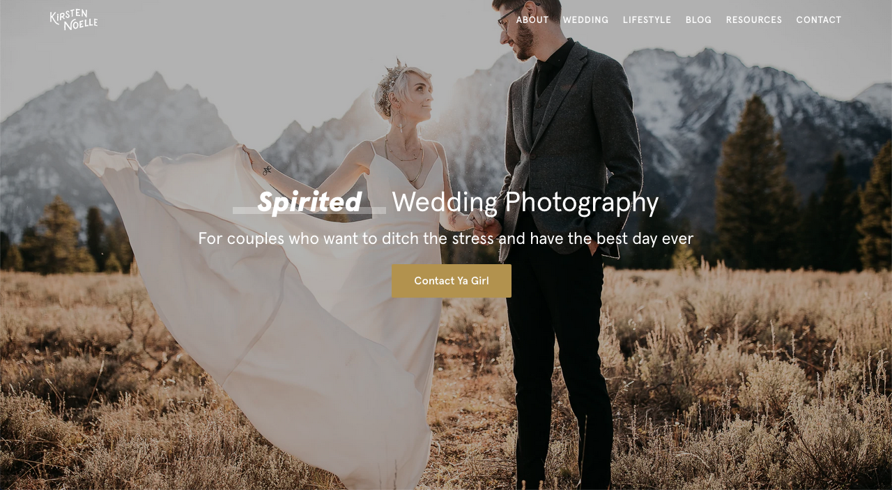
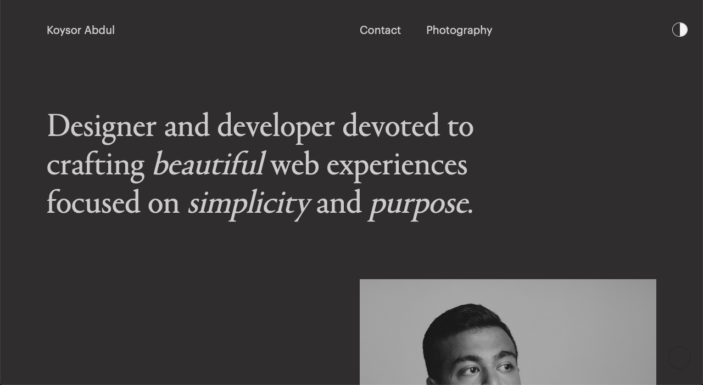
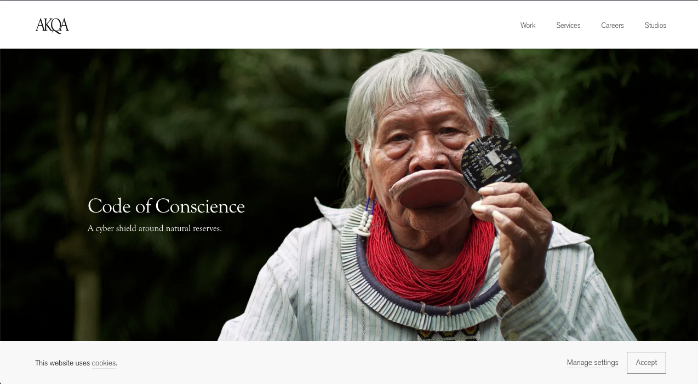
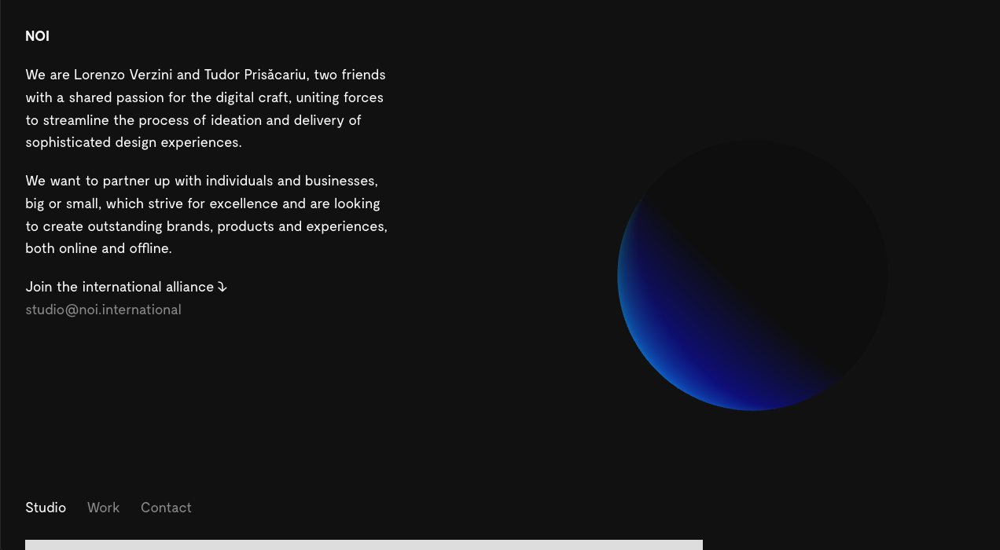
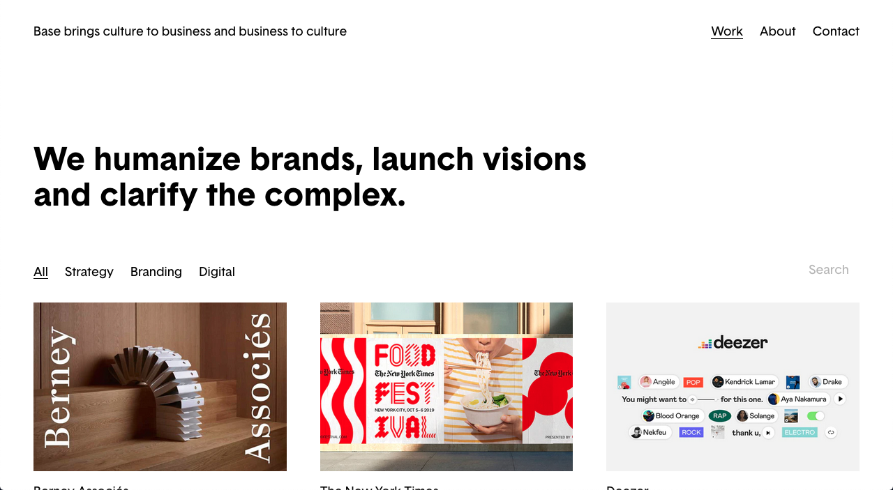
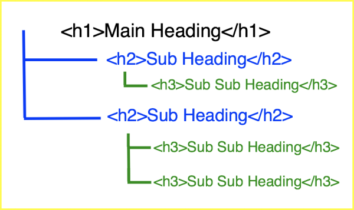
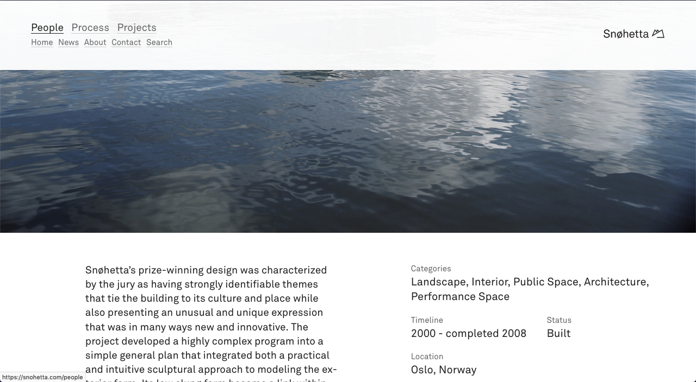
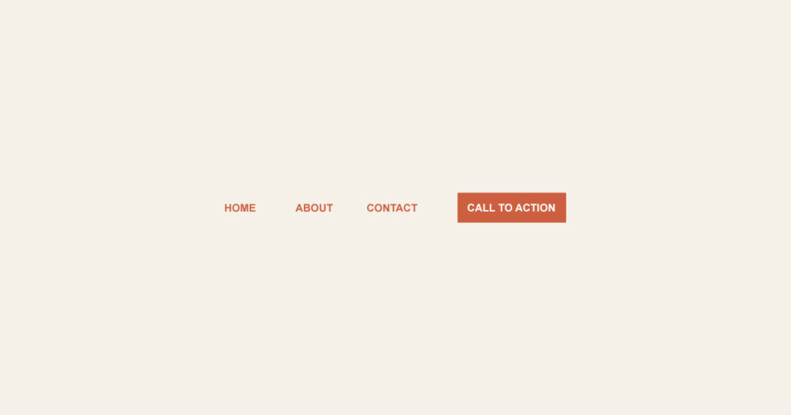
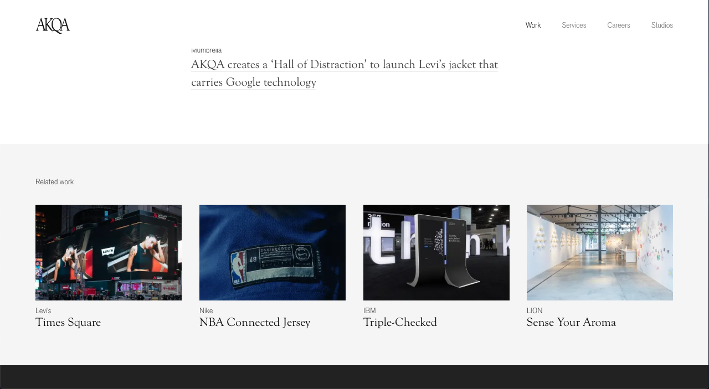
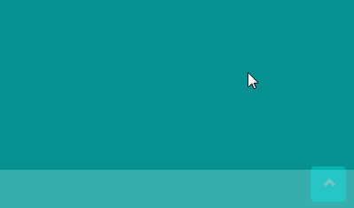

# Créer un Portfolio avec Wordpress

Quels sont les éléments clés qui font un bon portfolio Wordpress ? Un site qui vous présentera rapidement, saura mettre votre profil en valeur et
qui, *in fine*, vous aidera à décrocher un poste, une mission, un nouveau client … Nous allons étudier aujourd'hui les différents points
(éditorial, ergonomie, design, réferencement) qui vous aiderons à poser les bases d'un portfolio WordPress utile et efficace.

## Un outil de présentation avant tout

Avant d'aborder des points plus techniques, nous allons nous focaliser sur l'aspect éditorial. La manière dont vous présentez votre profil,
ainsi que vos travaux et réalisations, va déterminer la manière dont vous envisagez la création de votre site.

Un point clé à garder en tête lors de la création de votre portfolio est votre cible. Il vous faut comprendre à qui s'adressera votre site : un recruteur ? Un client ? Une agence ?
En identifiant votre cible, vous serez plus apte à mettre en avant les contenus que ce visiteur vient chercher sur votre site.

### Les éléments clés

> Quand un recruteur ou des potentiels clients visitent votre portfolio en ligne, il doit n'y avoir aucune confusion sur ce que vous faites.

*www.kirstennoelle.com*

Votre page d'accueil doit donc présenter une combinaison des éléments suivants :
- Un logo ou élément d'identité
- Un slogan/phrase d'accroche qui vous présente en quelques mots
- Un aperçu de vos dernières réalisations
- Une liste des services/qualifications que vous proposez

*www.koysor.me*

Une page 'À Propos' vous permettra d'aller plus loin dans la présentation de votre profil et de vos compétences.

Une page 'Contact' est éssentielle pour regrouper toutes vos informations sociales (mail, réseaux etc.)

Un CTA 'Contactez-moi' doit être présent sur l'ensemble ou la plupart des pages du site (dans le header par exemple) pour faciliter la prise de contact à n'importe quel moment de la visite.
Ce bouton peut être un lien vers votre page Contact, un lien `mailto` ou un lien vers un formulaire de contact. 

### La séléction de travaux

La sélection de travaux que vous allez opérer doit mettre en avant vos forces et aptitudes. Éviter donc de mettre "un peu de tout".
Quel est votre profil ? Design Graphique, Direction Artistique, Web, Illustration. Un profil clairement identifiable sera plus fort.

### Une interface simple

*akqa.com*

La force de votre portfolio repose avant tout sur les travaux et compétences que vous y présentez. 
L'écueil à éviter est de perdre un temps infini à peaufiner certains détails de mise en forme ou de design.
Votre portfolio doit être fonctionnel et lisible avant tout. 

*http://noi.international*

Soyez créatif dans les projets que vous présentez.
Pour votre site, cherchez surtout la lisibilité et simplicité.

*basedesign.com*

## Contenu et Réferencement

Ne soyez pas trop radin en contenu texte. La rédaction de contenu texte pour un portfolio en ligne peut être une tâche pénible mais elle est
également éssentielle pour deux raisons :

- **Didactique** : La présentation de votre profil (compétences, expériences etc.) et de vos projets (références, démarche, étapes de travail)
doit être etayée et claire. Il ne faut pas non plus rédiger un roman pour chaque projet ou une autobiographie dans la page 'À Propos' mais
tout doit être clair et compréhensible pour le visiteur.
- **Stratégique** : Le contenu texte a un impact sur le réferencement de votre site. Si le mot 'webdesign' apparaît beaucoup sur votre site, les moteurs de recherche
seront en mesure de le comprendre et feront remonter votre site dans les recherches relatives au webdesign.

### Respecter les balises 
# H1 Grand Titre
Il n'y a qu'une seule balise H1 sur une page Web. C'est le titre en somme.
## H2 Sous-Titre
### H3 Sous-Titre
Toutes les balises inférieures peuvent apparaitre plusieurs fois dans la mesure ou l'ordre est respecté.
On ne peut pas trouver de balises H3 si il n'y a pas de balises H2 auparavant.

### Aller plus loin avec le référencement

Le référencement est une science aléatoire, vaste et complexe. Il est préférable de se faire aider et d'obtenir des informations en la matière.

- [Yoast SEO](https://wpmarmite.com/wordpress-seo/) est un plugin Wordpress qui donne de nombreux conseils et outils pour faciliter le référencement de votre site web.
- [Bien débuter en référencement naturel](https://support.google.com/webmasters/answer/7451184?hl=fr&ref_topic=9460495) - Page Google
qui donne les grandes lignes et bonnes pratiques à suivre pour le référencement naturel. 

## Éléments de navigation

### Le header

L'outil de navigation de votre site doit être clair, simple d'utilisation et lisible (attention au choix des typos).
Il est également recommandé d'utiliser un header fixe (qui vous suit durant le scroll) afin de faciliter la navigation du visiteur.
Pour les sites portfolios, c'est presque une convention aujourd'hui, surtout si vos pages de contenu sont un peu longues.

*snohetta.com*

Un CTA de Contact en fin de navigation facilitera la prise de contact (fonctionnalité disponible dans le thème Astra).

### Le bas de page

Que se passe-t-il lorsqu'un visiteur atteint la fin d'une page Projet ? Va-t-on le laisser en plan ?
Il faut au contraire l'encourager à poursuivre sa visite sur le site, ou à effectuer un engagement sur notre site.
Il est très courant de trouver une navigation de bas de page encourageant le visiteur à consulter des articles connexes.

*akqa.com*

### Le footer

On aborde rarement la question du footer et il a donc tendance à être delaissé ou oublié.
Pensez à réintégrer des informations de contact et vos liens sociaux.
Si vous n'optez pas pour le header fixe, pensez à intégrer des éléments de navigation dans le footer et, si les pages travaux sont longues,
un bouton de retour en haut de page ou un bouton de retour à la page précèdente seront très utiles pour la navigation.

## Exercices et mises en application

Pour le prochain cours :
- page Home
- page Travaux
- page Projet

